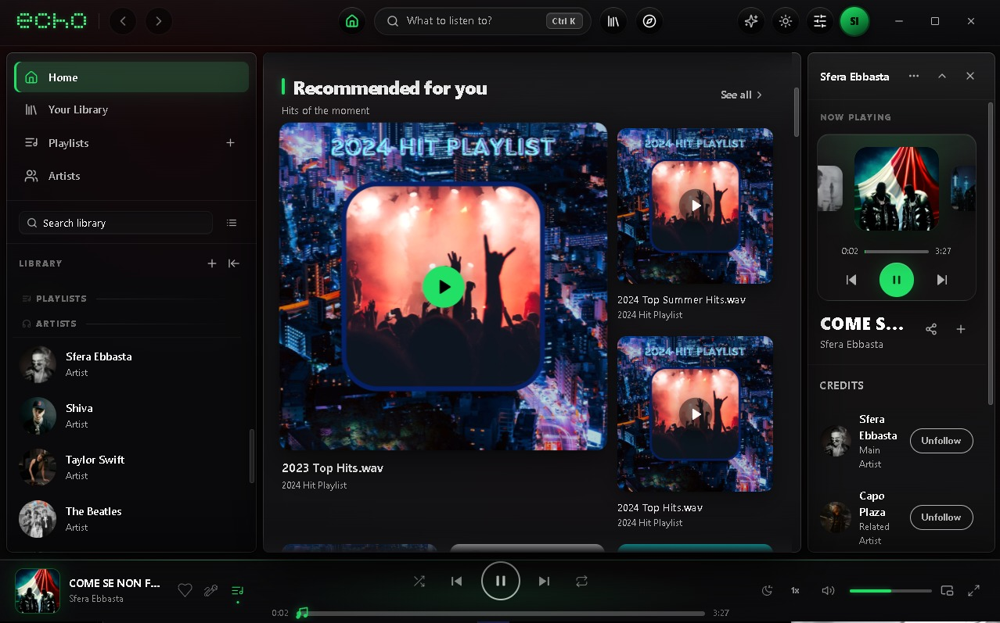
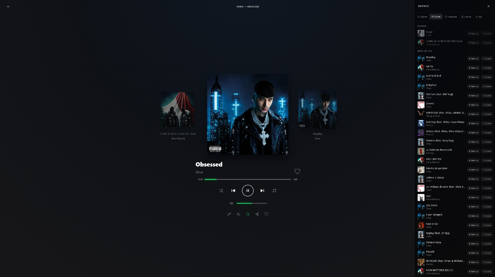
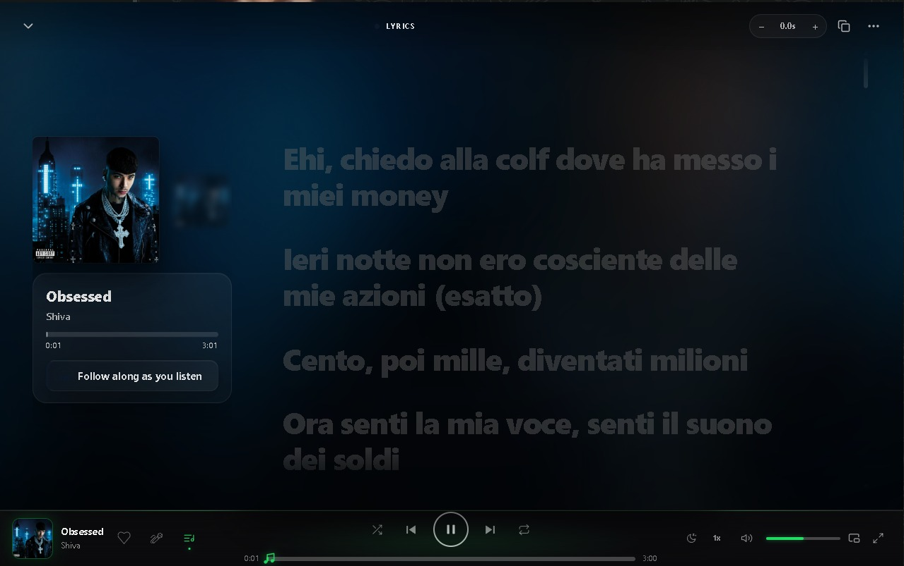
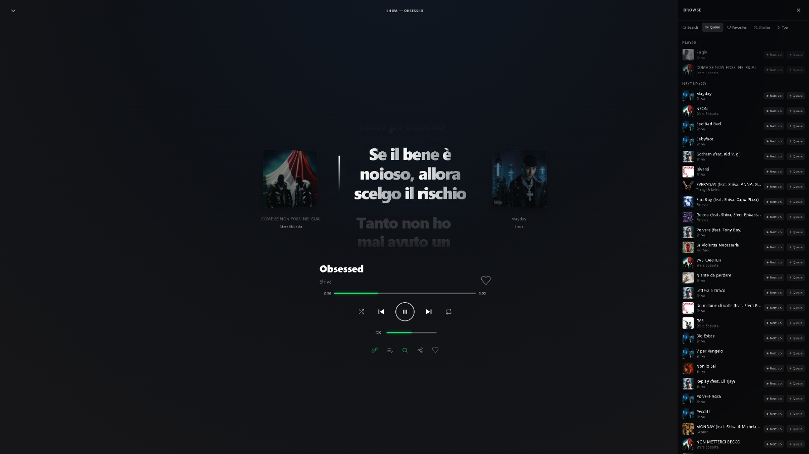

# Echo

**A fast, beautiful, free desktop music player for Windows.**

Your music, your library, your listening history — with synced lyrics, a built-in assistant, Discord Rich Presence and much more.

[**Download**](#download) · [What's new](#whats-new) · [Screenshots](#screenshots) · [Features](#features) · [Install](#install) · [FAQ](#faq)

---

## Download

> Latest release: **[Echo v0.2.1](https://github.com/lastdayfin1-bit/Echo-Music-Player/releases/latest)**

| Platform | File | Notes |
|---|---|---|
| Windows 10 / 11 (64-bit) | `Echo_0.2.1_x64-setup.exe` | NSIS installer — **recommended** |
| Windows 10 / 11 (64-bit) | `Echo_0.2.1_x64_en-US.msi` | MSI installer (enterprise-friendly) |

macOS and Linux builds are planned.

## What's new

**0.2.1** — *artist data restored.* Deezer retired the chart/top endpoints the app relied on, which left artist pages without their popular tracks and the first-run picker without artists to choose from. Both are now rebuilt from the endpoints that are still served, so popular tracks, similar artists and suggestions load again.

### 0.2.0 highlights

- **Better sound** — per-track level analysis: loudness normalisation plus real clipping protection (a measured peak ceiling), so loud masters no longer distort and quiet ones no longer disappear.
- **Refined interface** — a new pixel wordmark, deeper panels and cards across the app, and crisper controls at every UI zoom level.
- **Lyrics** — the current-line card wraps long lines instead of cutting them with an ellipsis, and the upcoming track now peeks beside the cover, sliding in smoothly when you skip.
- **Profile dashboard** — top artists and tracks, a daily listening chart, a distribution breakdown and a shareable-style summary card.
- **Mini player** — rebuilt compact window: theme-aware, with app tooltips, a live playback indicator and a proper volume control.
- **Themes** — theme presets, light-mode polish and a custom accent colour that now reaches every control.
- **Settings** — redesigned controls (segmented pickers, switches, action buttons) with consistent depth, hover and focus states.

Full list in the [changelog](CHANGELOG.md).

## Screenshots

| Home | Now Playing |
|---|---|
|  |  |
|  |  |

## Features

- **Play from multiple sources** — keep the music you already listen to in one library, without switching apps.
- **Synced lyrics** — line-by-line, with a manual sync offset when a file is a little off.
- **Smart queues** — play next, add to queue, listening history and per-track statistics.
- **Playlists & favourites** — create, import and like; everything stays on your machine.
- **Profile dashboard** — your listening wrapped: top artists, top tracks and charts.
- **Echo AI** — a built-in assistant that can chat, explore your library and control playback, running on local models. *Temporarily paused — see [Known issues](#known-issues).*
- **DJ tools** — mix view and remix library.
- **Mini player** — compact always-on-top window, picture-in-picture mode and system tray controls.
- **Discord Rich Presence** — show what you're listening to.
- **Themes** — light/dark mode, theme presets and a custom accent colour.
- **6 languages** — English, Italiano, Español, Français, Deutsch, Português.
- **Offline downloads** — keep tracks available when you're not online.
- **Sleep timer, crossfade, volume normalisation and clipping protection.**

## Install

### Windows

1. Download `Echo_0.2.1_x64-setup.exe` from the [latest release](https://github.com/lastdayfin1-bit/Echo-Music-Player/releases/latest).
2. Run the installer.
3. If Windows SmartScreen shows *"Windows protected your PC"*, click **More info → Run anyway**.
   Echo is not yet code-signed, so this warning is expected — the binary is built directly from the author's machine.
4. Launch Echo from the Start Menu or desktop shortcut.

To uninstall, use *Settings → Apps → Echo*.

## System requirements

- Windows 10 (1809+) or Windows 11, 64-bit
- [Microsoft Edge WebView2 Runtime](https://developer.microsoft.com/microsoft-edge/webview2/) — already installed on Windows 11 and most Windows 10 systems; the installer can fetch it if missing
- Internet connection for streaming

## Known issues

- **Echo AI is temporarily paused.** The assistant panel is disabled in this build while the local model backend is being reworked; it will return in a future update. Playback, lyrics, library, themes and the rest of the app are unaffected.

## FAQ

**Is Echo open source?**
No. Echo is proprietary software distributed as a prebuilt binary. This repository contains documentation and releases only — the source code is private.

**Is it free?**
Yes — Echo is completely free. No account, no subscription, no license key. Download, install and play.

**Does Echo collect my data?**
No. Your library, playlists, settings and listening history live locally on your machine. Nothing is uploaded, and there is no analytics or telemetry. Discord Rich Presence is optional and can be turned off in Settings.

**How do I update?**
Download the installer for the new version and run it — your library, playlists and settings are kept.

**Where is the AI assistant?**
Temporarily paused in this build — see [Known issues](#known-issues).

**Where are macOS and Linux builds?**
Planned. Follow this repository to get notified.

**Something is broken / I have an idea.**
[Open an issue](https://github.com/lastdayfin1-bit/Echo-Music-Player/issues) — include your Windows version and, if it's a playback problem, the track and what happened.

## License

Copyright © 2026. **All rights reserved.** See [LICENSE](LICENSE).

## Links

- Issues & feedback: [open an issue](https://github.com/lastdayfin1-bit/Echo-Music-Player/issues)
- Releases: [github.com/lastdayfin1-bit/Echo-Music-Player/releases](https://github.com/lastdayfin1-bit/Echo-Music-Player/releases)
